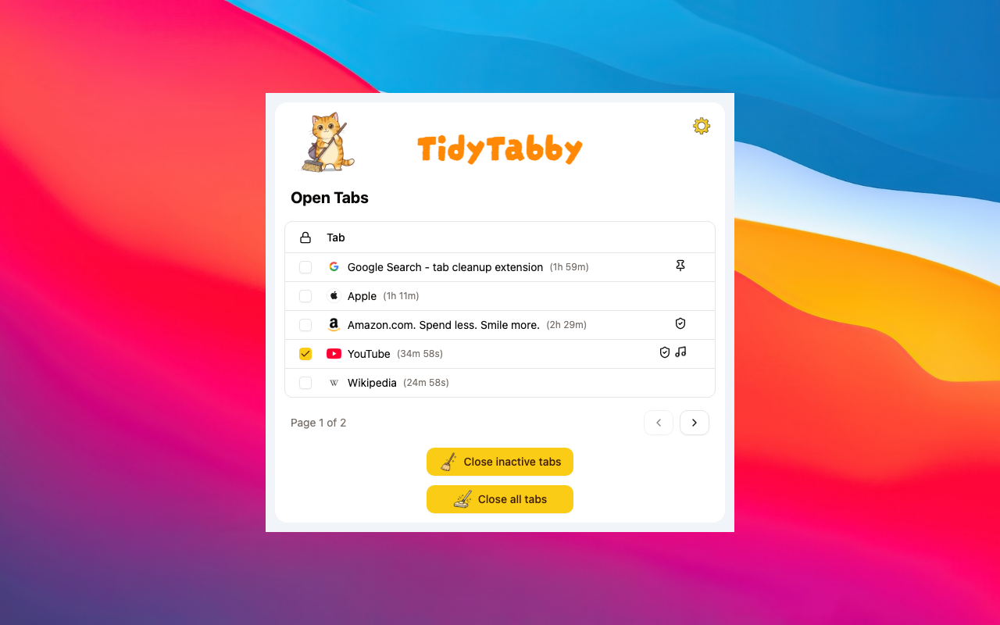

<p align="center">
  
</p>

# TidyTabby

TidyTabby is a Chrome extension that keeps your browser clean by automatically closing tabs that have been inactive for too long.

<p align="center">
  
</p>

## Features

### Auto Close

Automatically closes inactive tabs after a configurable timeout period. You can set the timeout in hours and minutes.

### Smart Timeout

When enabled, frequently visited tabs get extended timeouts before being closed. The extension tracks your browsing patterns and uses exponential decay weighting to prioritize tabs you visit often.

### Tab Locking

Lock individual tabs to protect them from being closed. Locked tabs persist across browser sessions via URL matching.

### URL Exclusion Patterns

Add URL patterns to exclude specific sites from auto-closing. Any tab whose URL contains a pattern you've added will be protected.

### Protected Tabs

The following tabs are always protected from auto-closing:

- Active tab
- Pinned tabs
- Tabs playing audio
- Locked tabs
- Tabs matching excluded URL patterns

### Quick Actions

- **Close All Tabs**: Instantly close all unprotected tabs with one click
- **Close Inactive**: Manually trigger cleanup of inactive tabs

### Tab Management UI

- View all open tabs with their status indicators (pinned, playing audio, excluded)
- See countdown timers showing time remaining before each tab auto-closes
- Lock/unlock tabs directly from the popup
- Close individual tabs with a hover action
- Navigate between tabs by clicking their titles

### Theme Support

Light, dark, and system theme options.

## Installation

- [Install TidyTabby from Chrome Web Store](https://chromewebstore.google.com/detail/tidytabby/lghbcbiajpooldbbodilongjaenbpbim)

## Local installation:

1. Install dependencies:

   ```bash
   pnpm install
   ```

2. Build the extension:

   ```bash
   pnpm build
   ```

3. Load it in Chrome:
   - Open `chrome://extensions/`
   - Turn on **Developer mode**
   - Click **Load unpacked**
   - Select the `build` directory

## Contributions

This repository does not accept pull requests.

## License

MIT
